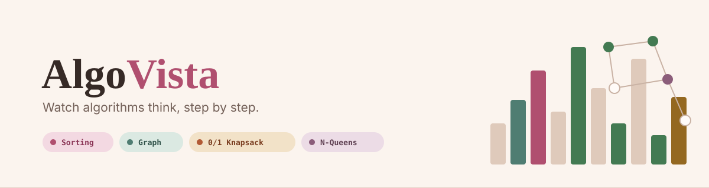
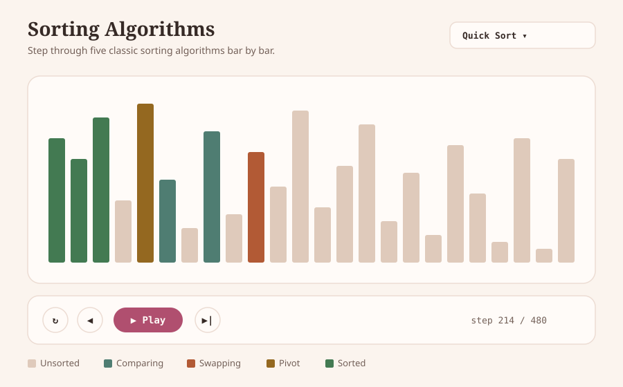
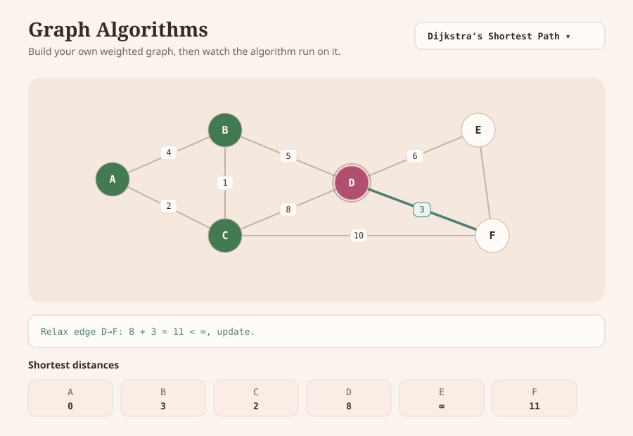
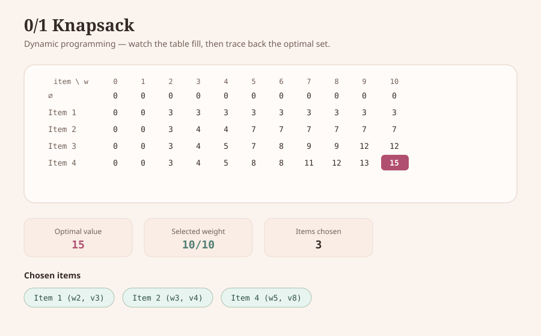
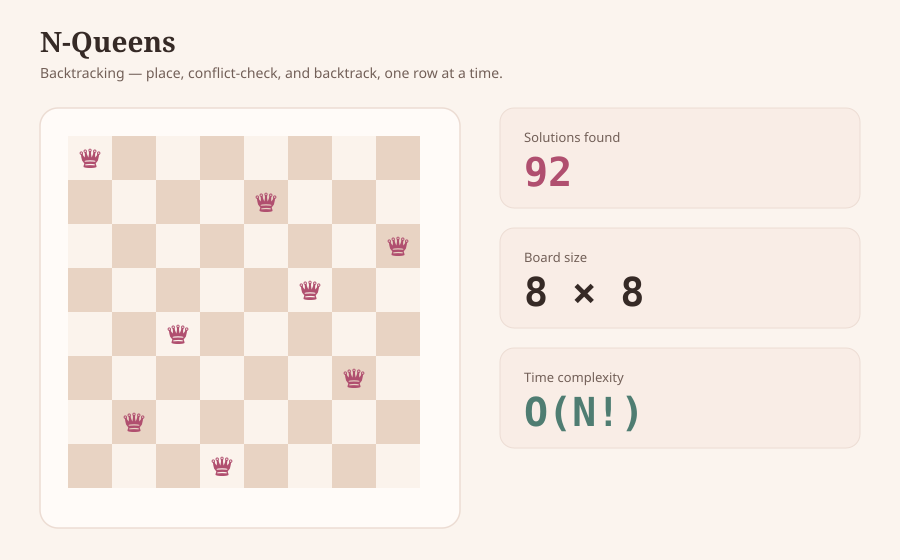

<div align="center">



<br/>

[](https://github.com/nayana3333/AlgoVista-dsa-visualizer/actions/workflows/ci.yml)
[](LICENSE)
[](https://react.dev)
[](https://www.typescriptlang.org)
[](src/algorithms)

**[▶ Live Demo](https://nayana3333.github.io/AlgoVista-dsa-visualizer/)** — no install required, opens in your browser

</div>

---

Textbook pseudocode tells you *what* an algorithm does. It rarely shows you *why* it takes the path it does — which comparison triggered a swap, which edge got rejected and why, which subproblem a DP table cell actually depends on. AlgoVista exists to close that gap: every algorithm below runs one real step at a time, in front of you, with the state that produced each decision visible the whole way through.

It covers four algorithmic paradigms end to end — **sorting, graph theory, dynamic programming, and backtracking** — with a graph editor you build yourself, not a fixed demo graph.

## Contents

- [Preview](#preview)
- [Features](#features)
- [How it works](#how-it-works)
- [Tech stack](#tech-stack)
- [Getting started](#getting-started)
- [Testing](#testing)
- [CI/CD](#cicd)
- [Project structure](#project-structure)
- [Complexity reference](#complexity-reference)
- [Roadmap](#roadmap)
- [Contributing](#contributing)
- [License](#license)

## Preview

<table>
<tr>
<td width="50%">

**Sorting** — comparison/swap-level detail


</td>
<td width="50%">

**Graph** — build it, then watch it get solved


</td>
</tr>
<tr>
<td width="50%">

**0/1 Knapsack** — the DP table, filled and traced back


</td>
<td width="50%">

**N-Queens** — backtracking with a live solution count


</td>
</tr>
</table>

## Features

| Area | Algorithms | What you can do |
|---|---|---|
| **Sorting** | Bubble, Selection, Insertion, Merge, Quick | Swap algorithms on the same array mid-comparison; live comparison/swap counters; array size 6–70 |
| **Graph** | Dijkstra's, Prim's, Kruskal's, Floyd–Warshall, Topological Sort | Add nodes, connect weighted edges, drag to rearrange, edit weights inline — the graph is yours, not a fixture |
| **Dynamic Programming** | 0/1 Knapsack | Edit items and capacity live; watch the table fill cell by cell; traced-back optimal selection |
| **Backtracking** | N-Queens | Board sizes 4–9 (capped deliberately — see [Roadmap](#roadmap)); live solution counter; visualized conflict rejection |

Every visualizer, regardless of paradigm, ships with the same controls: **play / pause / step / scrub / speed**, a **pseudocode panel** that highlights alongside the animation, and a **time/space complexity** readout.

## How it works

The core design decision: algorithm logic is a plain generator function that knows nothing about React. Each `yield` is one animation frame. The UI layer just consumes the generator and renders whatever state it yields — which means the exact same code that implements the algorithm is what drives the visualization, with no separate "animation logic" to keep in sync.

```ts
// src/algorithms/sorting.ts — real excerpt, not paraphrased
export interface SortStep {
  array: number[];
  comparing: number[];
  swapping: number[];
  sorted: number[];
  pivot?: number;
}

function* bubbleSort(arr: number[]): Generator<SortStep> {
  const a = [...arr];
  const n = a.length;
  const sorted: number[] = [];
  for (let i = 0; i < n - 1; i++) {
    let swapped = false;
    for (let j = 0; j < n - i - 1; j++) {
      yield snapshot(a, [j, j + 1], [], sorted);        // comparing
      if (a[j] > a[j + 1]) {
        [a[j], a[j + 1]] = [a[j + 1], a[j]];
        swapped = true;
        yield snapshot(a, [], [j, j + 1], sorted);       // swapping
      }
    }
    sorted.unshift(n - i - 1);
    if (!swapped) break;                                // already sorted — stop early
  }
}
```

A shared [`usePlayback`](src/hooks/usePlayback.ts) hook turns any array of steps into play/pause/step/scrub controls — it doesn't know or care whether the steps came from a sort, a graph traversal, or a backtracking search. That reuse is also what makes the algorithm layer independently unit-testable: [`sorting.test.ts`](src/algorithms/sorting.test.ts) never touches React at all.

## Tech stack

React 19 · TypeScript (strict) · Vite · Tailwind CSS v4 · Framer Motion · React Router · Vitest

## Getting started

```bash
git clone https://github.com/nayana3333/AlgoVista-dsa-visualizer.git
cd AlgoVista-dsa-visualizer
npm install
npm run dev
```

| Command | Runs |
|---|---|
| `npm run dev` | Dev server with hot reload |
| `npm run build` | Type-check + production build |
| `npm test` | Full test suite, once |
| `npm run test:watch` | Test suite in watch mode |
| `npm run lint` | Static analysis (oxlint) |

## Testing

```bash
npm test
```

57 tests, all on the algorithm layer — correctness, not just "does it render":

- **Sorting** — every algorithm checked for sortedness and permutation-preservation across random, already-sorted, reverse-sorted, and duplicate-heavy inputs
- **Dijkstra / Prim / Kruskal / Floyd–Warshall** — checked against a hand-computed reference graph (exact shortest-path distances, MST weight of 13 via *two independently different* algorithms)
- **Topological Sort** — validated against every edge constraint in the DAG, not just a single expected ordering
- **0/1 Knapsack** — checked against a known-optimal instance, plus edge cases (zero capacity, an item heavier than capacity)
- **N-Queens** — solution counts checked against [OEIS A000170](https://oeis.org/A000170) for n = 4…8 (2, 10, 4, 40, 92), plus a conflict-free validity check on every returned board

## CI/CD

[`.github/workflows/ci.yml`](.github/workflows/ci.yml) runs on every push and pull request:

```
typecheck → lint → test → build → (main only) deploy to GitHub Pages
```

A push to `main` only reaches production after every prior step is green.

## Project structure

```
src/
  algorithms/   pure algorithm implementations (generator-based step producers) + their tests
  components/   shared UI — graph canvas, playback controls, buttons, panels
  data/         catalog metadata, graph presets
  hooks/        usePlayback — the generic play/pause/step/scrub controller
  pages/        one page per visualizer
```

## Complexity reference

| Algorithm | Paradigm | Time | Space |
|---|---|---|---|
| Bubble Sort | Sorting | O(n²) | O(1) |
| Selection Sort | Sorting | O(n²) | O(1) |
| Insertion Sort | Sorting | O(n²) | O(1) |
| Merge Sort | Sorting | O(n log n) | O(n) |
| Quick Sort | Sorting | O(n log n)\* | O(log n) |
| Dijkstra's | Graph | O(E log V) | O(V) |
| Prim's MST | Graph | O(E log V) | O(V) |
| Kruskal's MST | Graph | O(E log E) | O(V) |
| Floyd–Warshall | Graph | O(V³) | O(V²) |
| Topological Sort | Graph | O(V + E) | O(V) |
| 0/1 Knapsack | DP | O(n·W) | O(n·W) |
| N-Queens | Backtracking | O(N!) | O(N²) |

\* Quick Sort's worst case is O(n²); the table shows the practical average case.

## Roadmap

- [ ] A\* and BFS/DFS pathfinding on the same graph canvas
- [ ] Bitmask-optimized N-Queens to lift the board-size cap past 9×9
- [ ] Heap / priority-queue visualizer
- [ ] Shareable permalinks that encode a specific graph + algorithm state

## Contributing

Issues and pull requests are welcome. For anything non-trivial, please open an issue first to discuss the change — for a small, algorithm-focused codebase like this one, keeping the generator-function pattern consistent matters more than adding features fast.

## License

[MIT](LICENSE) © Nayana
